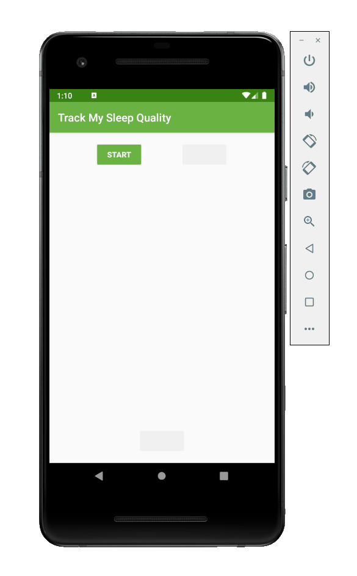

# SleepTrackerRV App

An Android application that uses a RecyclerView to track and display the user's sleep quality.

Submitted by: Yusley Rosabal Espinosa

Time spent: 4 hours

## User Stories

The following **required** functionality is complete:

* [X] Replace ScrollView with RecyclerView.
* [X] Create RecyclerView adapter and ViewHolder for data binding.
* [X] Display sleep quality list by using recycled ViewHolders.
* [X] Display sleep quality list using icons instead of text.

The following **additional** features are implemented:

* [X] Use database
* [X] Use of data binding

## Video Walkthrough 

Here's a walkthrough of implemented user stories:

## Notes

Describe any challenges encountered while building the app.

This app was easy because it was a continuation of the one from last week. However, I had some challenge. Using recycleviews and viewholders
was a more advantage programming than last week app.

Copyright 2019 Yusley Rosabal Espinosa

Licensed under the Apache License, Version 2.0 (the "License");
you may not use this file except in compliance with the License.
You may obtain a copy of the License at

http://www.apache.org/licenses/LICENSE-2.0

Unless required by applicable law or agreed to in writing, software
distributed under the License is distributed on an "AS IS" BASIS,
WITHOUT WARRANTIES OR CONDITIONS OF ANY KIND, either express or implied.
See the License for the specific language governing permissions and
limitations under the License.
